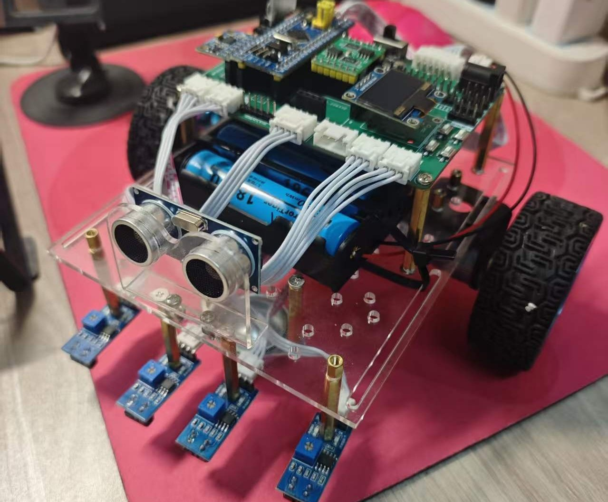
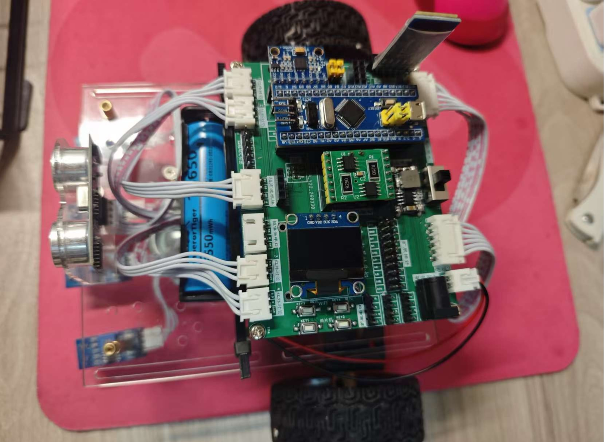
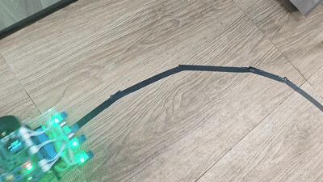
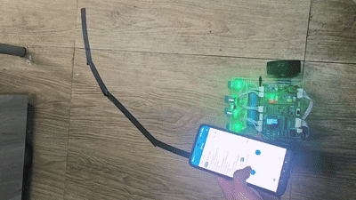
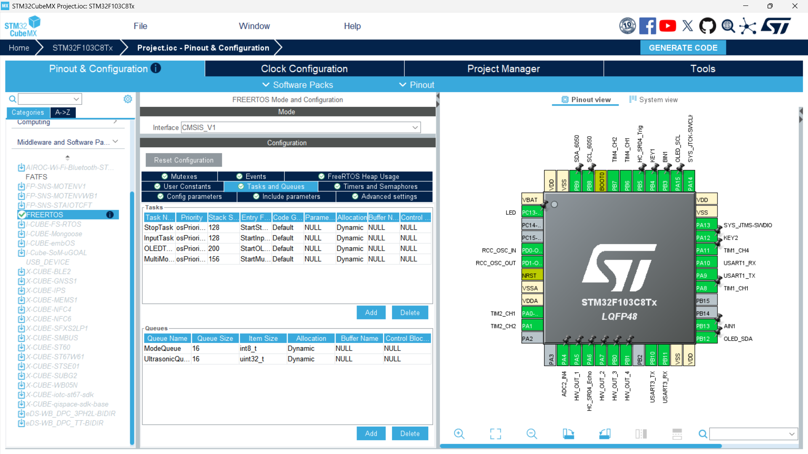
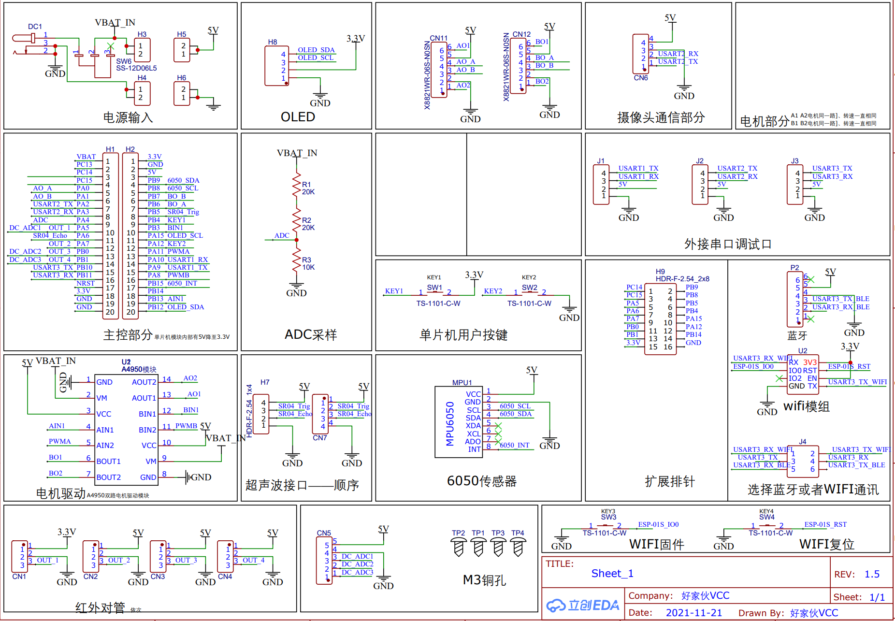

# STM32 Smart Car

基于 **STM32 / FreeRTOS / PID / CMake** 的智能车控制系统，面向嵌入式项目展示与求职作品集场景，聚焦多传感器协同控制、实时任务调度和可复现构建流程。

**English summary:** This project is a recruiter-facing STM32 smart car repository built around a FreeRTOS-based control system, PID-driven motion behaviors, Bluetooth joystick control, OLED status display, MPU6050 attitude sensing, and a CMake-based build flow. It demonstrates not only embedded feature delivery, but also architecture evolution from legacy Keil projects to a cleaner, reproducible firmware workspace.

## 项目亮点

- **FreeRTOS 多任务控制**：将输入、显示、模式切换和运动控制拆分为独立任务，并通过队列、信号量、互斥锁协调运行。
- **PID 控制落地**：完成红外循迹 PID、超声波跟随 PID、姿态辅助控制等闭环逻辑，而不是停留在单模块实验。
- **多传感器协同**：集成红外、超声波、MPU6050、蓝牙串口与 OLED，形成完整的智能车控制链路。
- **蓝牙摇杆遥控**：支持无线操控与模式切换，并加入失联超时保护，降低遥控场景下的误动作风险。
- **CMake + CubeMX 工程化**：在保留 `Project.ioc` 的同时补齐 CMake 工具链与 Preset，支持更现代的构建和索引体验。

## 项目展示

### 实物图




### 功能演示

| 避障 | 循迹 | 蓝牙摇杆控制 |
| --- | --- | --- |
|  |  |  |

### 结构/原理图




## 系统能力概览

| 能力 | 实现方式 | 关键模块 | 工程价值 |
| --- | --- | --- | --- |
| OLED 状态显示 | I2C OLED 实时显示运行状态、速度、距离和调试信息 | `HARDWARE/OLED` | 提升联调效率，降低“黑盒运行”问题 |
| 蓝牙遥控 | 串口接收遥控/摇杆数据并切换控制模式 | `Core/Src/usart.c`, `HARDWARE/joystick.c` | 支持无线交互与远程调试 |
| 红外循迹 | 4 路红外输入结合 PID 输出左右轮差速 | `SYSTEM/PID.c` | 将传感器偏差转化为稳定运动控制 |
| 超声波避障 | HC-SR04 测距 + 行为逻辑决策 | `HARDWARE/Sonic.c` | 实现环境感知与自主避障 |
| 超声波跟随 | 距离测量配合 PID 输出目标速度 | `HARDWARE/Sonic.c`, `SYSTEM/PID.c` | 体现闭环控制在场景中的真实使用 |
| MPU6050 姿态辅助 | 读取姿态信息并修正行走方向 | `HARDWARE/MPU6050`, `SYSTEM/PID.c` | 提升直行与转向控制的稳定性 |
| 多任务调度 | 任务、队列、信号量、互斥锁协同 | `Core/Src/freertos.c` | 体现 RTOS 架构设计能力 |
| CMake 构建 | Preset + 工具链文件 + CubeMX 生成代码 | `CMakeLists.txt`, `CMakePresets.json`, `cmake/` | 体现从 IDE 工程到现代构建的升级能力 |

## 软件架构

当前主版本为 **CMake + FreeRTOS** 工程，核心任务划分如下：

- `StopTask`：处理停车态与安全停止逻辑，确保模式为停止时电机输出及时清零。
- `InputTask`：接收按键/蓝牙输入，负责模式切换与输入事件分发。
- `OLEDTask`：刷新显示内容，输出速度、距离、模式和调试状态。
- `MultiModeTask`：承载主要模式逻辑，包括循迹、跟随、避障和姿态辅助控制。

配套同步机制：

- `ModeQueue`：传递模式切换事件
- `UltrasonicQueue`：传递测距相关数据
- `OLED_Mutex`：保护多任务下的 OLED 共享访问
- `KeySem`：同步按键/输入事件

从读者视角看，这个项目的重点不只是“功能能跑”，而是已经形成了比较清楚的控制链路：

1. 输入侧接收蓝牙或按键事件。
2. 调度侧根据当前模式分发控制逻辑。
3. 控制侧结合红外、超声波、MPU6050 数据执行 PID 或行为决策。
4. 输出侧驱动电机并将关键状态显示到 OLED。

## 关键优化

### 1. 超声波读数滤波与时序修正

- 在 `HARDWARE/Sonic.c` 中加入移动平均滤波，降低 HC-SR04 抖动对控制策略的影响。
- 按模块时序要求约束最小读数间隔，避免高频读取造成测距异常。
- 对超时和无效测距增加保护逻辑，减少异常值直接传入控制环。

### 2. OLED 多任务互斥访问

- FreeRTOS 版本中使用 `OLED_Mutex` 保护显示资源，避免多个任务同时写屏导致乱码或显示错乱。
- 将显示从“附属逻辑”提升为独立任务，让调试信息输出更稳定。

### 3. 摇杆超时保护

- 在 `HARDWARE/joystick.c` 中记录最近一次有效摇杆包的时间戳。
- 当蓝牙摇杆数据超时未更新时，不再继续写入电机目标速度，降低失联后车辆继续运行的风险。

### 4. 姿态、速度与 PID 联动

- 用电机转速 PID 保证基础速度控制。
- 用红外循迹 PID 和超声波跟随 PID 生成差速/速度调整量。
- 用 MPU6050 姿态信息修正直线行驶和转向行为，提高运动稳定性。

## 快速开始

### 环境依赖

- `arm-none-eabi-gcc`
- `cmake >= 3.22`
- `ninja`
- STM32CubeMX 生成的工程基础文件

### 配置与构建

```bash
cmake --preset Debug
cmake --build --preset Debug
```

默认 Preset 会使用仓库中的工具链文件：

- `cmake/gcc-arm-none-eabi.cmake`
- `cmake/stm32cubemx/CMakeLists.txt`

### 重新打开 CubeMX 工程

如需调整外设或重新生成初始化代码，可使用 STM32CubeMX 打开：

```text
Project.ioc
```

## 仓库结构

```text
.
|-- CMakeLists.txt
|-- CMakePresets.json
|-- Project.ioc
|-- Core/
|-- Drivers/
|-- HARDWARE/
|-- Middlewares/
|-- SYSTEM/
|-- cmake/
|-- docs/
`-- legacy/
```

- 根目录：当前主版本，面向持续维护和展示
- `legacy/bare-metal/`：早期裸机版本
- `legacy/freertos/`：早期 FreeRTOS + Keil 工程版本

## 项目演进

这个仓库保留了项目从“能跑起来”到“更像一个完整工程”的演进过程：

- **当前主版本**：CMake + FreeRTOS，强调结构清晰、构建可复现、便于扩展
- **历史版本**：裸机版与早期 FreeRTOS/Keil 版，作为功能验证与架构演进记录

这对求职展示很重要，因为它不仅说明你做过一个智能车，还说明你有把项目逐步工程化的意识和能力。

## Resume-ready Summary

**中文简历描述：**

基于 STM32F103 的智能车控制系统，使用 FreeRTOS 构建多任务控制架构，集成 OLED 显示、蓝牙摇杆遥控、红外循迹、超声波避障/跟随、MPU6050 姿态辅助控制等功能；使用 PID 算法完成循迹、跟随与运动修正，并将项目升级为支持 CMake + CubeMX 的可复现嵌入式构建工程。

**English resume summary:**

Built an STM32F103-based smart car control system with a FreeRTOS task architecture, integrating OLED display, Bluetooth joystick control, infrared line tracking, ultrasonic obstacle avoidance/following, and MPU6050-based attitude assistance. Implemented PID-driven motion control and evolved the firmware into a reproducible CMake + CubeMX embedded project.
